# 🚀 Web Dev Playground

Welcome to **Web Dev Playground**, a modern, AI-powered IDE designed for rapid web development, UI experimentation, and intelligent design transformation. This platform combines a responsive code editor with advanced visual editing tools and deep AI integration.

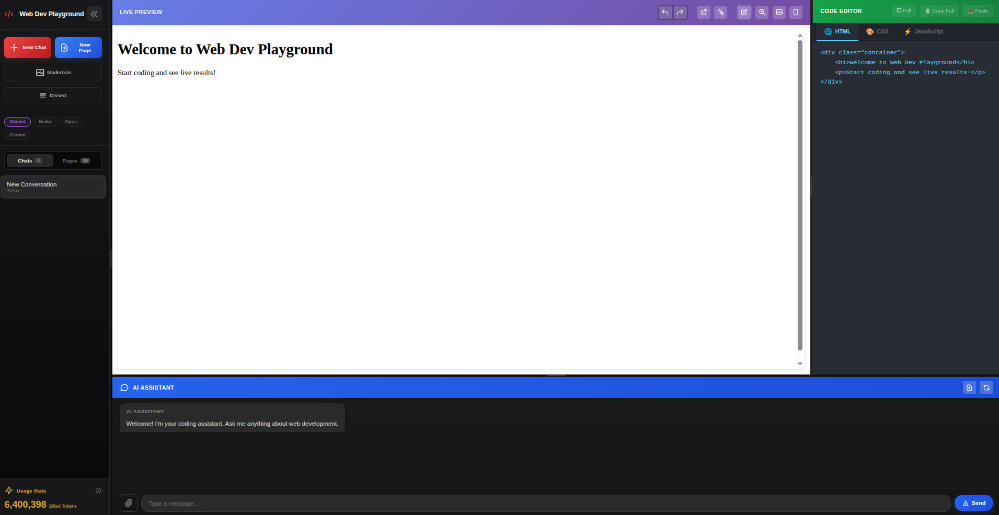

---

## 🛠️ Getting Started

### 1. Installation
Install the necessary dependencies for both the frontend and the backend:
```bash
npm install
```

### 2. Running the Application
You need to run two processes: the Vite development server and the backend proxy/AI service.

**Start the Frontend:**
```bash
npm run dev
```

**Start the Backend Server:**
```bash
npm run server
```

Access the application at `http://localhost:5173` (or the port specified by Vite).

---

## 📖 User Manual: Features & UI

### 📁 Sidebar: Management & Intelligence

The left sidebar is your command center for project organization and powerful AI utilities.

*   **➕ New Chat / New Page**:
    *   **New Chat**: Resets the environment and starts a fresh conversation with the AI.
    *   **New Page**: Creates a dedicated page or component view, separate from your main conversation.
*   **✨ Modernize Website (Experimental)**:
    *   *Status: This feature is currently in an experimental phase and is undergoing continuous improvement.*
    *   Click this to capture an existing website via URL.
    *   Choose a **Theme Style** (e.g., Cyberpunk, Minimalist, Luxury) and **Primary Color**.
    *   Claude will analyze the site's structure and rebuild it from scratch with a premium, modern aesthetic.

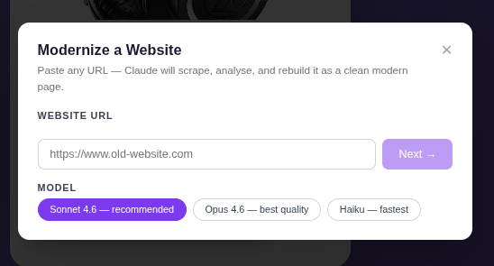
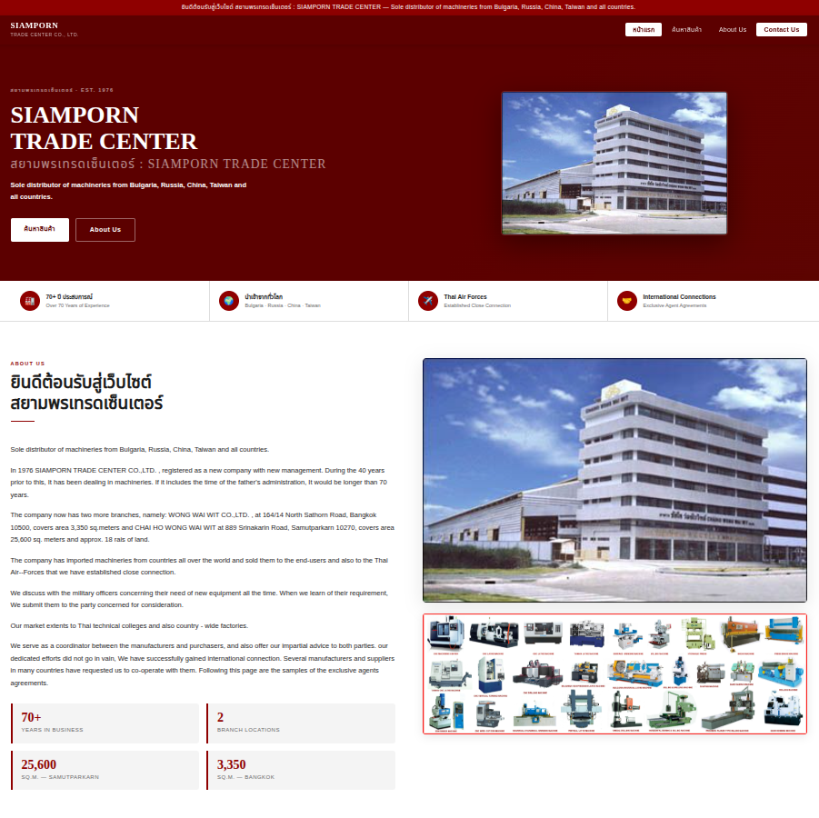

*   **✂️ Dissect HTML (Experimental)**:
    *   *Status: Experimental. We are refining the logic for better section identification.*
    *   Automatically parses your current HTML into logical blocks (Navbars, Heroes, Footers, etc.).
    *   **Eye Icon (👁️)**: Preview individual sections.
    *   **Dissect Button**: Extract selected sections into reusable components.
*   **🤖 Model Selection**:
    *   Toggle between **Sonnet**, **Haiku**, **Opus**, and **Gemini** to adjust the AI's intelligence and speed.
*   **📊 Usage Stats**:
    *   Real-time tracking of **Billed Tokens**.
    *   Click the **Details (i)** icon for a breakdown of Input, Output, and Cache (Write/Read) tokens based on Anthropic pricing.

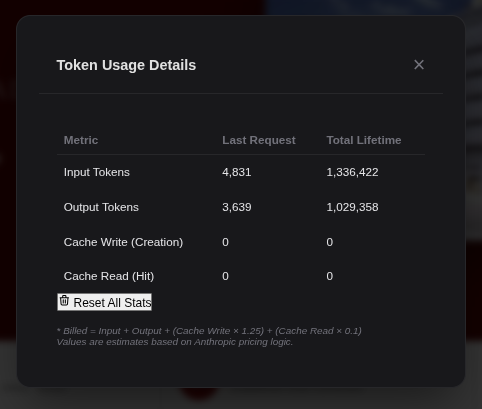

---

### 👁️ Live Preview: Visual Editing Suite

The central preview pane isn't just for viewing—it's a fully interactive design suite.

*   **⛶ Shape Selection Mode (AI Visual Edit)**:
    *   **How to use**: Click the icon, select a shape (Rectangle or Circle), and drag over the preview to highlight specific sections.
    *   **AI Context**: All elements within the shape are sent to the AI Assistant. 
    *   **Targeted Instructions**: You can then type instructions like "Change this button to red" or "Make this text larger," and the AI will focus exclusively on the selected elements.

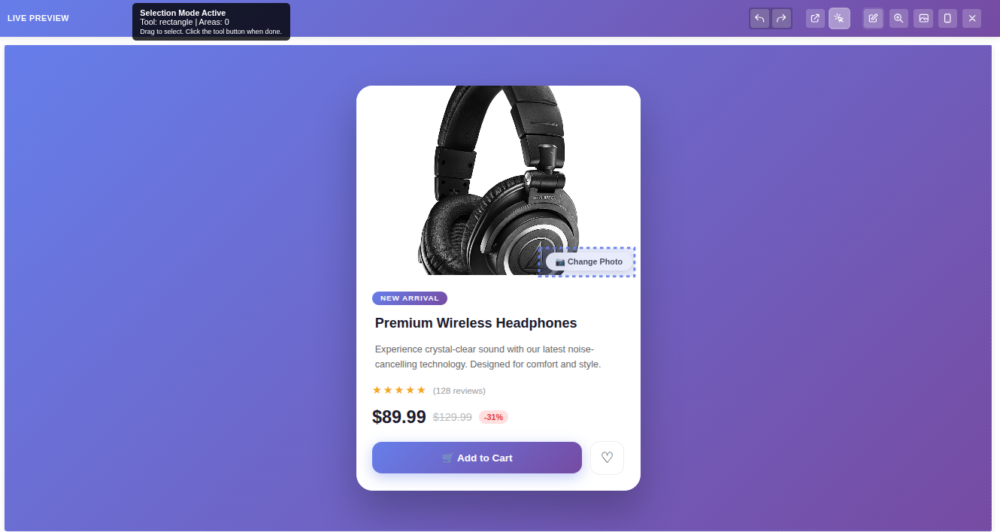
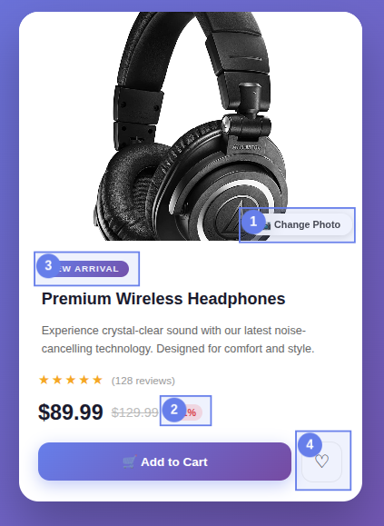
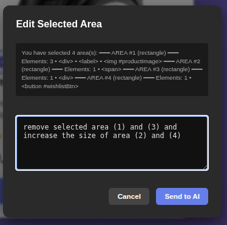
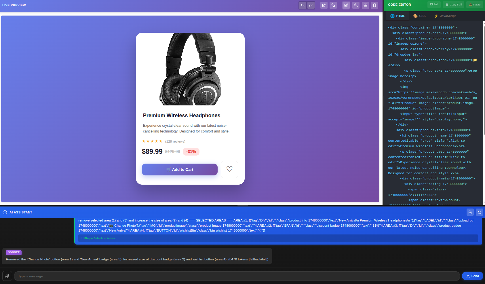

*   **🅰️ Text Edit Mode (Direct Styling)**:
    *   **Direct Editing**: Once activated, click any text element on the page to edit its content directly.
    *   **Live Styling Bar**: A floating toolbar appears for the selected element, allowing you to tweak **Font Size**, **Font Family**, **Font Weight**, and **Text Color** via a color picker.
    *   **Auto-Sync**: Click "Save" to instantly update the source HTML/CSS in the editor.

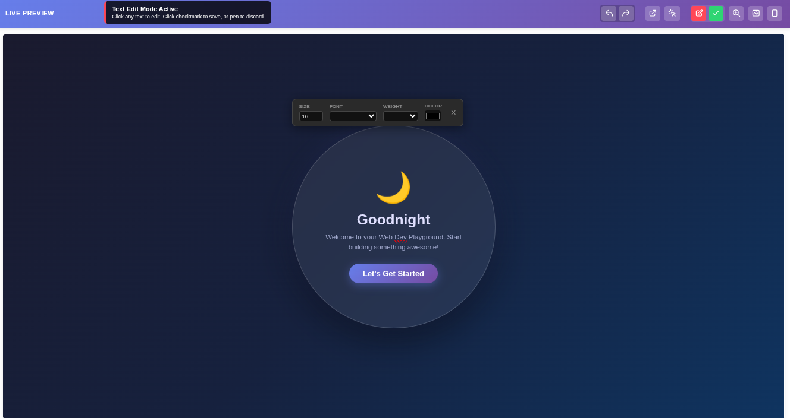

*   **🔍 Inspect Mode (Source Mapping)**:
    *   **Element Tracking**: Hover over any section to see a blue highlight. 
    *   **Jump to Code**: Click an element to instantly scroll the code editor to the exact line where that element is defined.

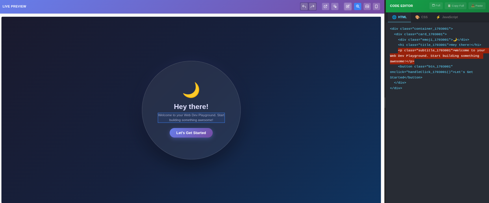

*   **🖼️ Image Edit Mode (Asset Manager)**:
    *   **Visual Swap**: Click any `` tag or element with a `background-image` style.
    *   **Source Update**: A modal allows you to paste a new image URL or change the `src` attribute visually without manual code editing.

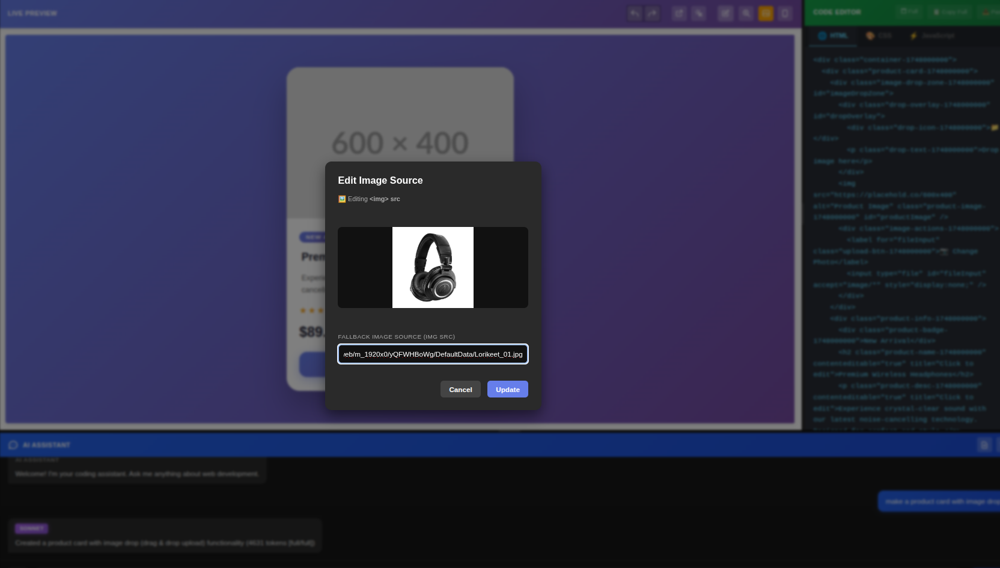

---

### 💻 Code Editor: The Engine Room

A multi-tabbed editor for writing raw code with state-of-the-art developer experience.

*   **Tabs**: Dedicated views for **HTML**, **CSS**, and **JavaScript**.
*   **🗖 Fullscreen**: Expand the editor to focus entirely on the code.
*   **📋 Copy/Paste Utilities**:
    *   **Copy Full**: Exports the entire project as a single standalone HTML file.
    *   **Paste**: Import full HTML files; the playground will automatically split them into HTML, CSS, and JS tabs.
*   **↩️ Undo / Redo**: Full history management for all code changes, including AI-generated updates.

---

### 💬 AI Assistant: Collaborative Coding

The bottom panel is where you communicate with the AI to build your application.

*   **Adaptive Pipeline**: The AI understands your intent. If you ask for a "blue button," it knows to update only the CSS.
*   **📎 Attachments**: Upload images (screenshots, design inspo) for the AI to replicate or reference in its code generation.
*   **Responsive Editing**: Use in conjunction with Shape Selection for ultra-precise UI modifications.

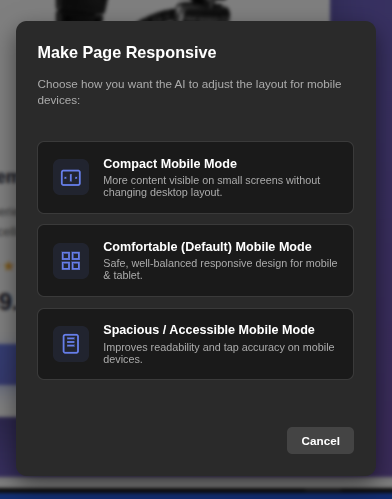

*   **Save Component**: Instantly add your currently viewed code to your personal component library.

---

## 💡 Example Prompts

Try these to see the power of the platform:
- *"สร้างการ์ดสินค้าแบบ e-commerce ที่มีรูปสินค้าหมุนได้ 360 องศา"*
- *"Add a glassmorphism effect to the current container and make it responsive."*
- *"Implement a countdown timer for the promotion section with a sleek dark theme."*

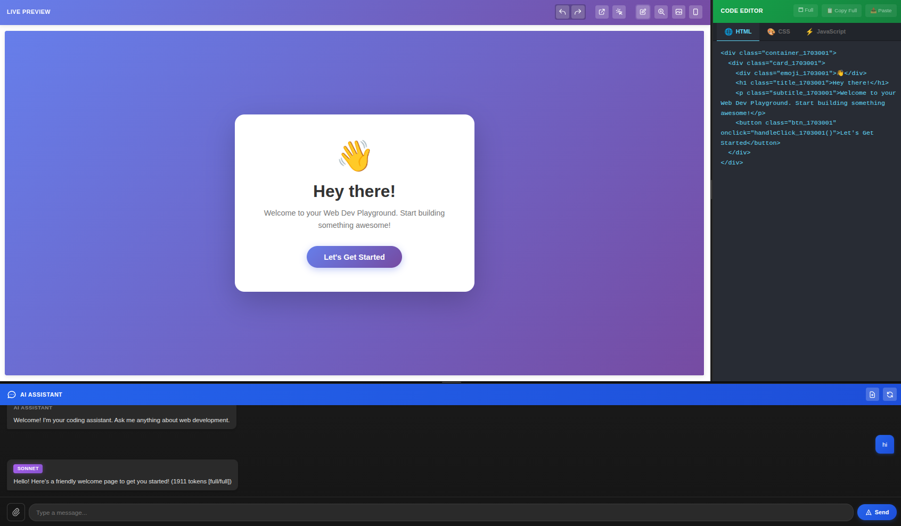
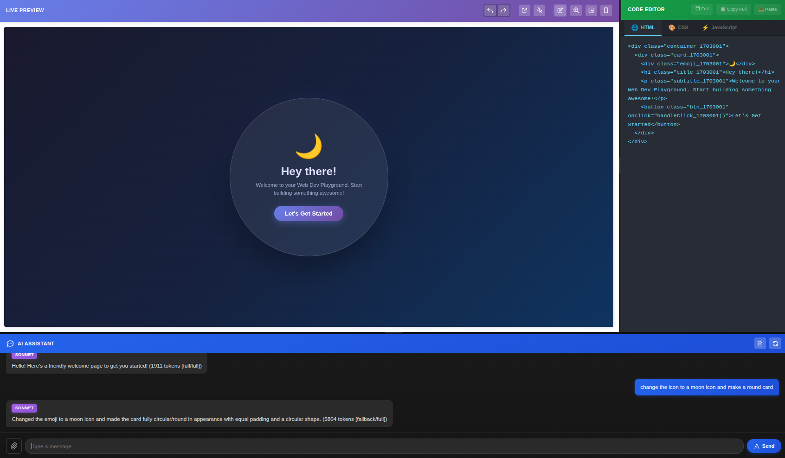

---

## 🚀 Roadmap / To-Do
- [ ] Real-time collaboration features.
- [ ] Integrated image generation for placeholders.
- [ ] One-click deployment to Vercel/Netlify.
